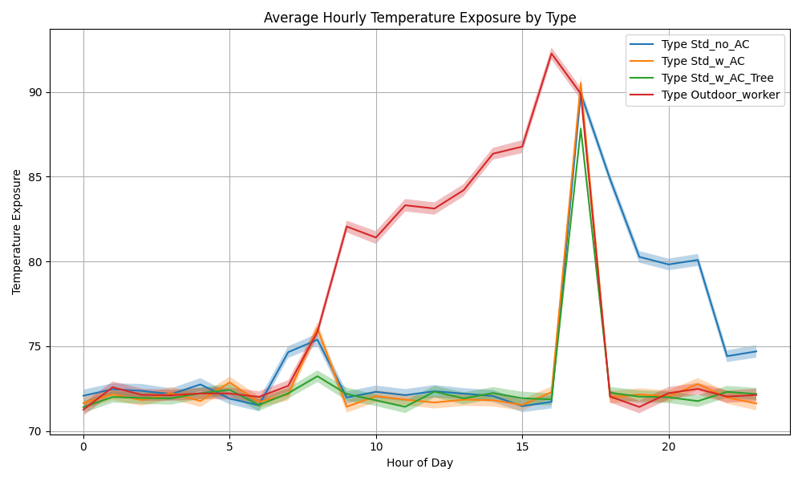

Code for the WT project

Running `main.py` creates the population, runs in parallel, and graphs average exposure by population type.

Interventions can be simulated by changing the distribution of people in each sub-population
Similarly, trees can be simulated by switching someone's time-activity for `Outside` to `Outside w/ Trees`

Estimating the net change in impacts can follow from the above, just need to decide on the right metric.

Running this using the JetBrain community edition IDE, makes it pretty easy.

